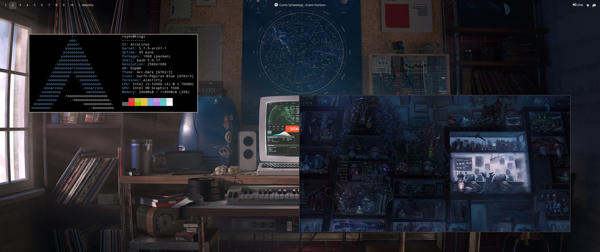

# Clean Polybar
**Clean Polybar** is a personal project, a way to achieve an elegant, simple and clean polybar that shows your workspaces, window title, spotify music and volume control keeping a clean style with a transparent background color.



## Installation

> I'm working on a *bash-script* to to this process automatically.

The installation process is simple, just follow this steps:

1. Clone the repository
```bash
git clone https://github.com/imreyesjorge/clean-polybar
```

2. `cd` into the directory
```bash
cd clean-polybar
```

3. Copy the `config` file inside `polybar/` directory to any of the places that polybar visit to fetch their configuration (such as `~/.config/polybar/config`
```bash
cp polybar/config ~/.config/polybar/
```

> If you already have a `config` file in the directory, you can *back-up* the file changing his name to `config.bak`.

4. Now you can remove the repository from your computer.
